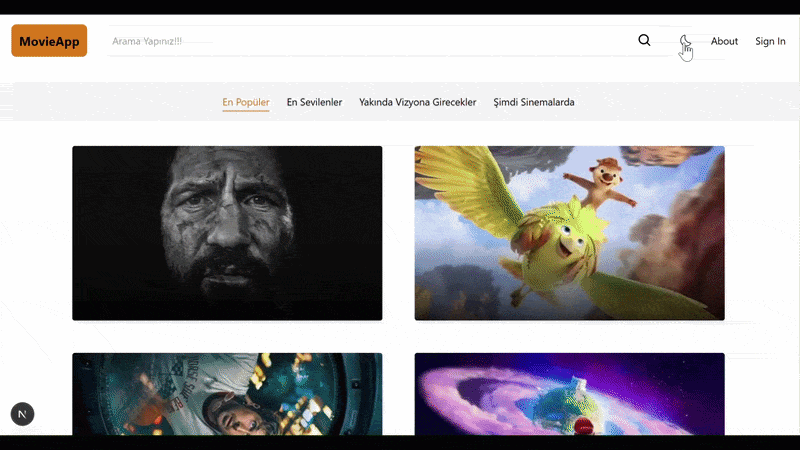

# 🎬 MovieApp (movie-next)

Modern, hızlı ve duyarlı (responsive) tasarıma sahip bir film keşif ve listeleme web uygulamasıdır. Kullanıcıların güncel sinema içeriklerine, popüler filmlere ve vizyondaki yapımlara tek bir noktadan ulaşmasını, arama filtreleri ile detaylı bilgilere erişmesini sağlar.

## 🎬 Demo



## 🚀 Özellikler

* **Kategori Tabanlı Listeleme:** Ana sayfa üzerinden dinamik olarak ayrıştırılmış 4 ana kategori:
  * 🔥 **En Popüler:** En çok ilgi gören trend filmler.
  * ⭐ **En Sevilenler:** Kullanıcılar tarafından yüksek puan alan yapımlar.
  * 📅 **Yakında Vizyona Girecekler:** Gelecek programda yer alan filmler.
  * 🍿 **Şimdi Sinemalarda:** Güncel olarak sinema salonlarında gösterimde olanlar.
* **Gelişmiş Canlı Arama & Filtreleme:** Arama çubuğu üzerinden gerçek zamanlı ve harf duyarlı dinamik filtreleme yapısı.
* **Dinamik Film Detay Sayfası:** Her film için özel arka plan görseli, detaylı konu özeti (sinopsis), vizyon yılı, IMDb puanı gösterimi ve fragman (Trailer) erişimi.
* **Etkileşimli Film Kartları (Hover Effect):** Film afişlerinin üzerine gelindiğinde (hover) dinamik olarak tetiklenen, film adını, vizyon tarihini ve IMDb puanını akıcı bir animasyonla kart üzerinde gösteren modern kullanıcı deneyimi.
* **Gelişmiş Tema Desteği:** `next-themes` entegrasyonu ile sağ üst menüden tek tıkla Açık/Karanlık (Light/Dark Mode) tema geçişi.
* **Tam Duyarlı Tasarım (Responsive UI):** Mobil, tablet ve masaüstü cihazlar ile tam uyumlu modern arayüz tasarımı.

## 🛠️ Kullanılan Teknolojiler ve Bağımlılıklar

### Çekirdek Yapı
* **Framework:** [Next.js (v16.1)](https://nextjs.org) (App/Pages Router)
* **Kütüphane:** [React (v19.2)](https://react.dev)
* **Programlama Dili:** [TypeScript (v5.9)](https://typescriptlang.org)

### Stil ve Görselleştirme
* **Tasarım:** [Tailwind CSS (v3.4 / v4 PostCSS)](https://tailwindcss.com) & Autoprefixer
* **Tema Yönetimi:** `next-themes` (v0.4)
* **İkon Kütüphanesi:** `react-icons` (v5.5)

### Derleyici Optimizasyonu
* `babel-plugin-react-compiler` (React'in yeni nesil otomatik memoization derleyicisi)

## 🔑 Çevre Değişkenleri (Environment Variables)

Projenin TMDB (The Movie Database) API üzerinden film verilerini çekebilmesi için kök dizinde bir `.env.local` dosyası oluşturmalı ve aşağıdaki anahtarları tanımlamalısınız:

```env
NEXT_PUBLIC_TMDB_API_KEY=your_tmdb_api_key_here
NEXT_PUBLIC_TMDB_KEY=your_tmdb_read_access_token_here
```

> ⚠️ **Not:** `NEXT_PUBLIC_` ön eki, bu değişkenlerin Next.js tarafında istemci (client-side) kodlarında da güvenli bir şekilde kullanılabilmesini sağlar.

## 📦 Kurulum ve Çalıştırma

Projeyi yerel geliştirme ortamınızda ayağa kaldırmak için aşağıdaki adımları takip edin:

### Gereksinimler
* Bilgisayarınızda **Node.js** (LTS sürümü önerilir) kurulu olmalıdır.

### Adımlar

1. Bu depoyu bilgisayarınıza kopyalayın:
   ```bash
   git clone https://github.com/HasanEROL1/next-movvie
   ```

2. Proje dizinine gidin:
   ```bash
   cd next-movvie
   ```

3. Gerekli tüm bağımlılıkları yükleyin:
   ```bash
   npm install
   ```

4. Yukarıda belirtilen `.env.local` dosyasını oluşturun ve API anahtarlarınızı girin.

5. Yerel geliştirme sunucusunu başlatın:
   ```bash
   npm run dev
   ```

6. Tarayıcınızdan `http://localhost:3000` adresine giderek uygulamayı görüntüleyin.

## ⚙️ Mevcut Komutlar (Scripts)

* `npm run dev`: Geliştirme modunda yerel sunucuyu başlatır.
* `npm run build`: Üretim (production) ortamı için projeyi optimize ederek derler.
* `npm run start`: Derlenmiş üretim sürümünü yayına alır.
